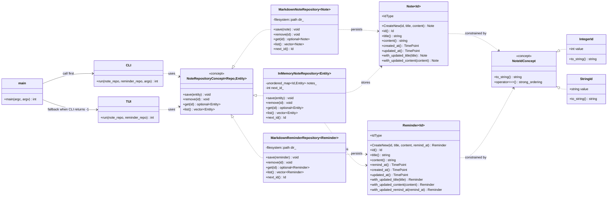

# Class Diagram

```mermaid
classDiagram
    direction LR

    class NoteIdConcept {
      <<concept>>
      +to_string() string
      +operator<=>() strong_ordering
    }

    class IntegerId {
      +int value
      +to_string() string
    }

    class StringId {
      +string value
      +to_string() string
    }

    NoteIdConcept <|.. IntegerId
    NoteIdConcept <|.. StringId

    class Note~Id~ {
      +IdType
      +CreateNew(id, title, content) Note
      +id() Id
      +title() string
      +content() string
      +created_at() TimePoint
      +updated_at() TimePoint
      +with_updated_title(title) Note
      +with_updated_content(content) Note
    }

    class Reminder~Id~ {
      +IdType
      +CreateNew(id, title, content, remind_at) Reminder
      +id() Id
      +title() string
      +content() string
      +remind_at() TimePoint
      +created_at() TimePoint
      +updated_at() TimePoint
      +with_updated_title(title) Reminder
      +with_updated_content(content) Reminder
      +with_updated_remind_at(remind_at) Reminder
    }

    Note~Id~ ..> NoteIdConcept : constrained by
    Reminder~Id~ ..> NoteIdConcept : constrained by

    class NoteRepositoryConcept~Repo,Entity~ {
      <<concept>>
      +save(entity) void
      +remove(id) void
      +get(id) optional~Entity~
      +list() vector~Entity~
    }

    class InMemoryNoteRepository~Entity~ {
      -unordered_map~Id,Entity~ notes_
      -int next_id_
      +save(entity) void
      +remove(id) void
      +get(id) optional~Entity~
      +list() vector~Entity~
      +next_id() Id
    }

    class MarkdownNoteRepository~Note~ {
      -filesystem::path dir_
      +save(note) void
      +remove(id) void
      +get(id) optional~Note~
      +list() vector~Note~
      +next_id() Id
    }

    class MarkdownReminderRepository~Reminder~ {
      -filesystem::path dir_
      +save(reminder) void
      +remove(id) void
      +get(id) optional~Reminder~
      +list() vector~Reminder~
      +next_id() Id
    }

    NoteRepositoryConcept~Repo,Entity~ <|.. InMemoryNoteRepository~Entity~
    NoteRepositoryConcept~Repo,Entity~ <|.. MarkdownNoteRepository~Note~
    NoteRepositoryConcept~Repo,Entity~ <|.. MarkdownReminderRepository~Reminder~

    class CLI {
      +run(note_repo, reminder_repo, args) int
    }

    class TUI {
      +run(note_repo, reminder_repo) int
    }

    class main {
      +main(argc, argv) int
    }

    main --> CLI : call first
    main --> TUI : fallback when CLI returns -1

    CLI ..> NoteRepositoryConcept~Repo,Entity~ : uses
    TUI ..> NoteRepositoryConcept~Repo,Entity~ : uses

    MarkdownNoteRepository~Note~ ..> Note~Id~ : persists
    MarkdownReminderRepository~Reminder~ ..> Reminder~Id~ : persists
    InMemoryNoteRepository~Entity~ ..> Note~Id~ : stores
    InMemoryNoteRepository~Entity~ ..> Reminder~Id~ : stores
```
