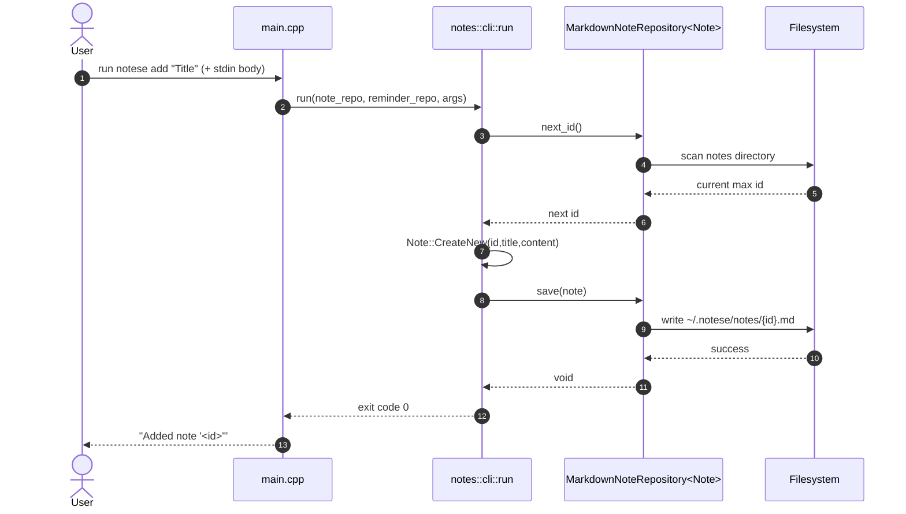

# Sequence Diagram: CLI Add Note

```mermaid
sequenceDiagram
    autonumber
    actor User
    participant Main as main.cpp
    participant CLI as notes::cli::run
    participant NoteRepo as MarkdownNoteRepository<Note>
    participant FS as Filesystem

    User->>Main: run notese add "Title" (+ stdin body)
    Main->>CLI: run(note_repo, reminder_repo, args)
    CLI->>NoteRepo: next_id()
    NoteRepo->>FS: scan notes directory
    FS-->>NoteRepo: current max id
    NoteRepo-->>CLI: next id

    CLI->>CLI: Note::CreateNew(id,title,content)
    CLI->>NoteRepo: save(note)
    NoteRepo->>FS: write ~/.notese/notes/{id}.md
    FS-->>NoteRepo: success
    NoteRepo-->>CLI: void

    CLI-->>Main: exit code 0
    Main-->>User: "Added note '<id>'"
```
