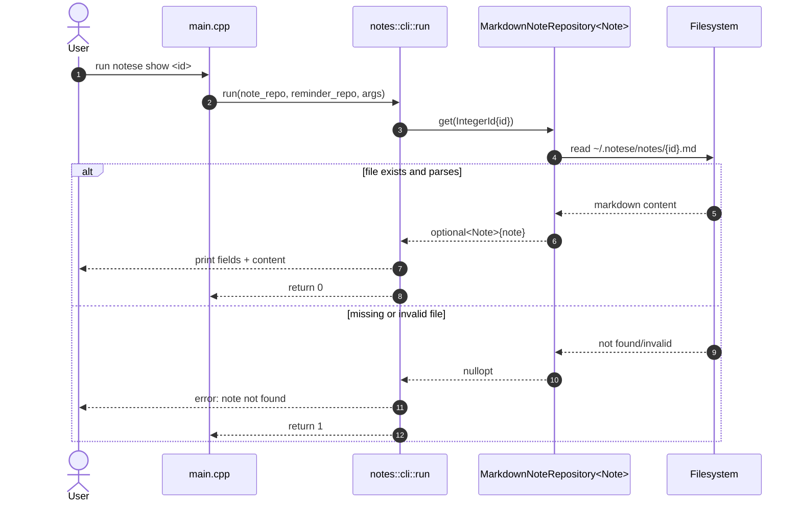

# Sequence Diagram: CLI Show Note

```mermaid
sequenceDiagram
    autonumber
    actor User
    participant Main as main.cpp
    participant CLI as notes::cli::run
    participant NoteRepo as MarkdownNoteRepository<Note>
    participant FS as Filesystem

    User->>Main: run notese show <id>
    Main->>CLI: run(note_repo, reminder_repo, args)
    CLI->>NoteRepo: get(IntegerId{id})
    NoteRepo->>FS: read ~/.notese/notes/{id}.md

    alt file exists and parses
      FS-->>NoteRepo: markdown content
      NoteRepo-->>CLI: optional<Note>{note}
      CLI-->>User: print fields + content
      CLI-->>Main: return 0
    else missing or invalid file
      FS-->>NoteRepo: not found/invalid
      NoteRepo-->>CLI: nullopt
      CLI-->>User: error: note not found
      CLI-->>Main: return 1
    end
```
