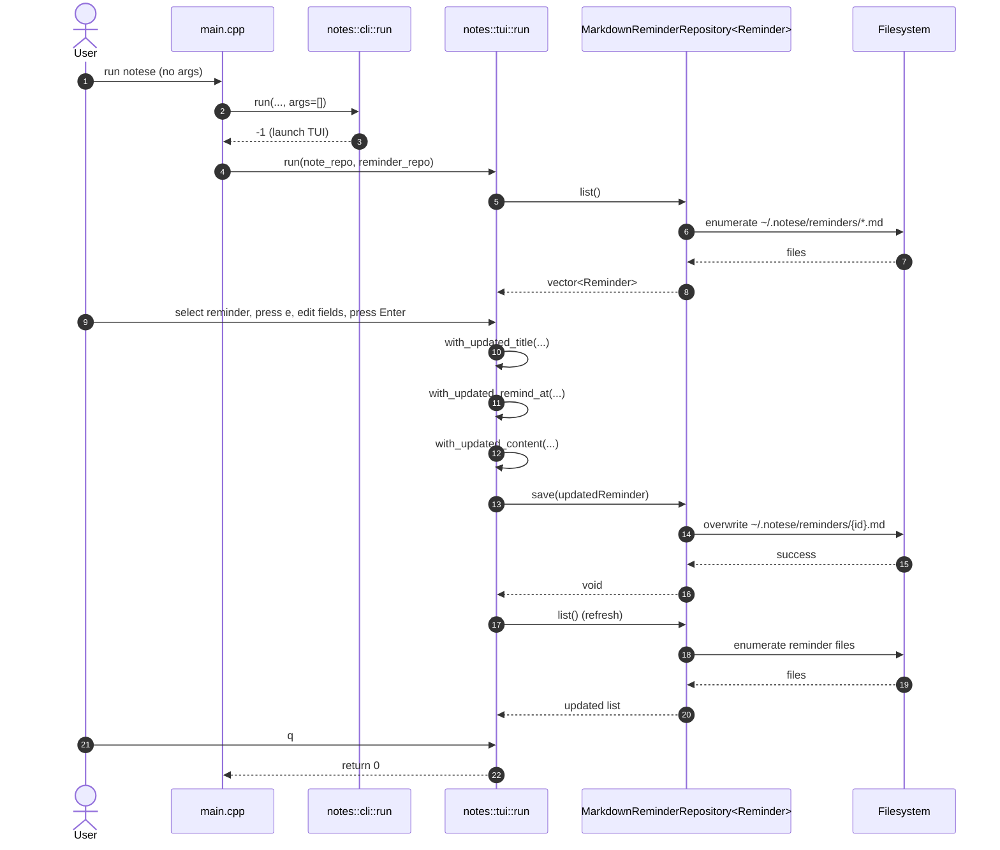

# Sequence Diagram: TUI Edit Reminder

```mermaid
sequenceDiagram
    autonumber
    actor User
    participant Main as main.cpp
    participant CLI as notes::cli::run
    participant TUI as notes::tui::run
    participant ReminderRepo as MarkdownReminderRepository<Reminder>
    participant FS as Filesystem

    User->>Main: run notese (no args)
    Main->>CLI: run(..., args=[])
    CLI-->>Main: -1 (launch TUI)
    Main->>TUI: run(note_repo, reminder_repo)

    TUI->>ReminderRepo: list()
    ReminderRepo->>FS: enumerate ~/.notese/reminders/*.md
    FS-->>ReminderRepo: files
    ReminderRepo-->>TUI: vector<Reminder>

    User->>TUI: select reminder, press e, edit fields, press Enter
    TUI->>TUI: with_updated_title(...)
    TUI->>TUI: with_updated_remind_at(...)
    TUI->>TUI: with_updated_content(...)
    TUI->>ReminderRepo: save(updatedReminder)
    ReminderRepo->>FS: overwrite ~/.notese/reminders/{id}.md
    FS-->>ReminderRepo: success
    ReminderRepo-->>TUI: void

    TUI->>ReminderRepo: list() (refresh)
    ReminderRepo->>FS: enumerate reminder files
    FS-->>ReminderRepo: files
    ReminderRepo-->>TUI: updated list

    User->>TUI: q
    TUI-->>Main: return 0
```
